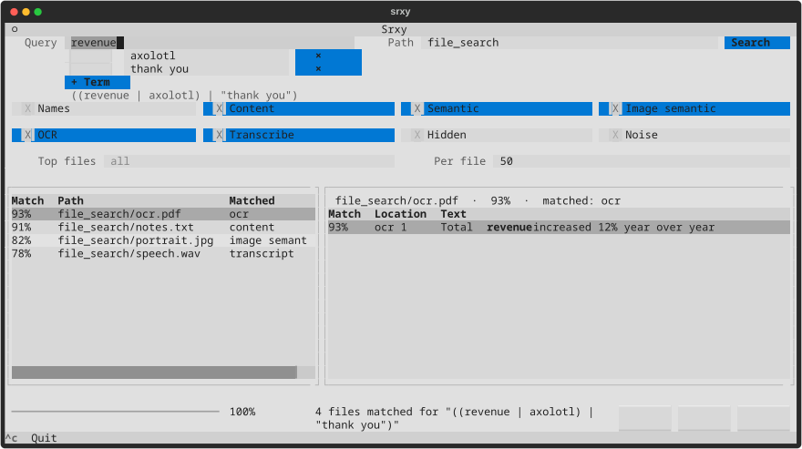

# Srxy

[](https://github.com/illescasDaniel/srxy/actions/workflows/ci.yml)
[](https://pypi.org/project/srxy/)
[](https://pypi.org/project/srxy/)

**Find files by what you mean — terminal or Python.**

Fuzzy, phonetic, and semantic matching across filenames, documents, photos, audio, video, and OS tags. On a TTY, **srxy opens a full-screen TUI by default**; use `--no-tui` for scripts and pipes.

## Installation

```bash
pipx install 'srxy[semantic]'   # recommended
pip install 'srxy[semantic]'
pip install srxy                   # core only (no PyTorch / semantic / transcription)
```

`[semantic]` adds sentence-transformers (text + CLIP), faster-whisper, rawpy, and on Linux `nvidia-cublas-cu12` for GPU transcription. Models download on first use.

You also need **ffmpeg** (transcription) and **tesseract** (OCR) on `PATH` — see [Power-ups](docs/power-ups.md).

## Quick start

**TUI (default on a TTY):**

```bash
srxy                          # empty query/path
srxy "registry" ./src         # pre-filled; auto-starts
srxy "transform" ./docs --ocr
```



Live scan progress, sortable results, preview pane, option chips, clipboard copy. Full walkthrough: [docs/tui.md](docs/tui.md).

**Plain CLI:**

```bash
srxy "registry" ./src --no-tui
srxy "revenue" ./docs --json
srxy "dog at the beach" ~/Pictures --semantic-image --content-only
srxy "revenue" ./docs --semantic-all --content-only
```

Boolean queries (`|`, `&`), scope flags, format table: [docs/cli.md](docs/cli.md).

**Python:**

```python
from pathlib import Path
from srxy import magic_file_search, magic_search

magic_file_search(Path("./src"), "registry", threshold=0.3)
magic_search([{"name": "salad"}], "salat", fields=["name"])
```

API reference: [docs/python-api.md](docs/python-api.md).

## Documentation

| Guide | Contents |
|-------|----------|
| [TUI](docs/tui.md) | Layout, keybindings, clipboard, release checklist |
| [CLI reference](docs/cli.md) | Flags, formats, boolean queries, exit codes |
| [Power-ups](docs/power-ups.md) | OCR, semantic, CLIP, transcription, models |
| [Python API](docs/python-api.md) | `magic_file_search`, `search`, `Q`, match types |
| [Development](docs/development.md) | Quality gate, `--full`, fixtures, pytest |

## Development

```bash
pip install -e ".[dev,semantic]"
./scripts/quality/checks.sh --fix
./scripts/quality/checks.sh              # day-to-day
./scripts/quality/checks.sh --full       # before release
./scripts/quality/checks.sh --full+cpu   # + forced-CPU transcribe matrix
```

CI runs unit tests only. Details: [docs/development.md](docs/development.md).

Try fixtures: `srxy "axolotl" ./tests/fixtures/file_search`

## License

MIT — see [LICENSE](LICENSE).
