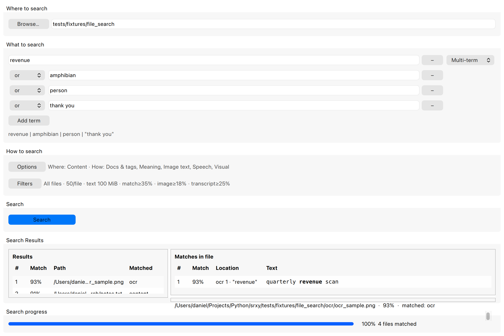
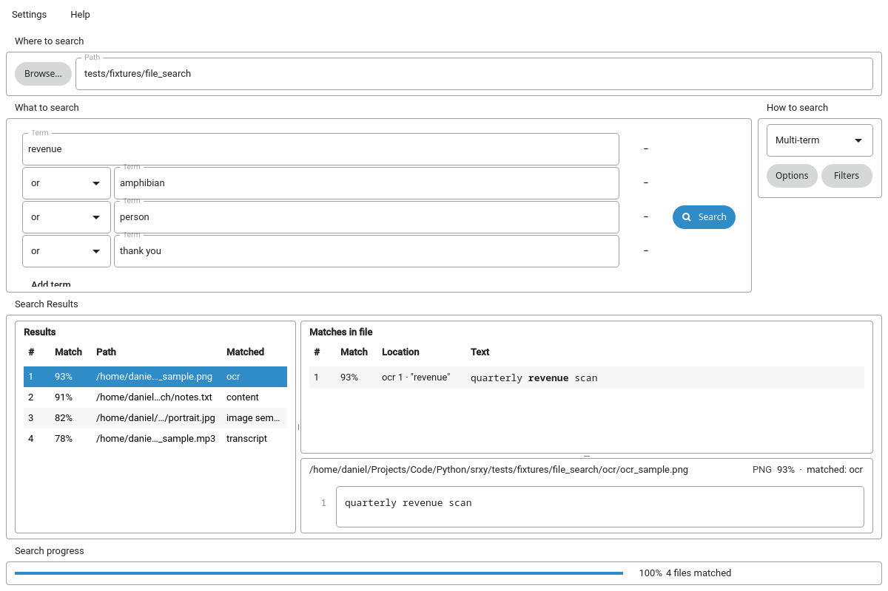
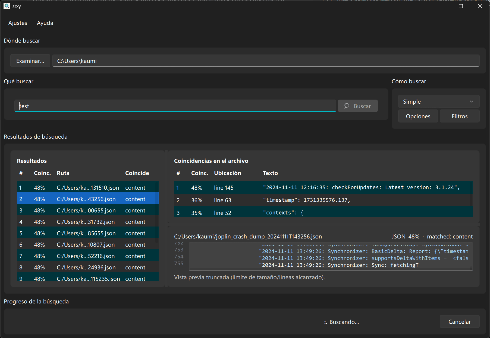
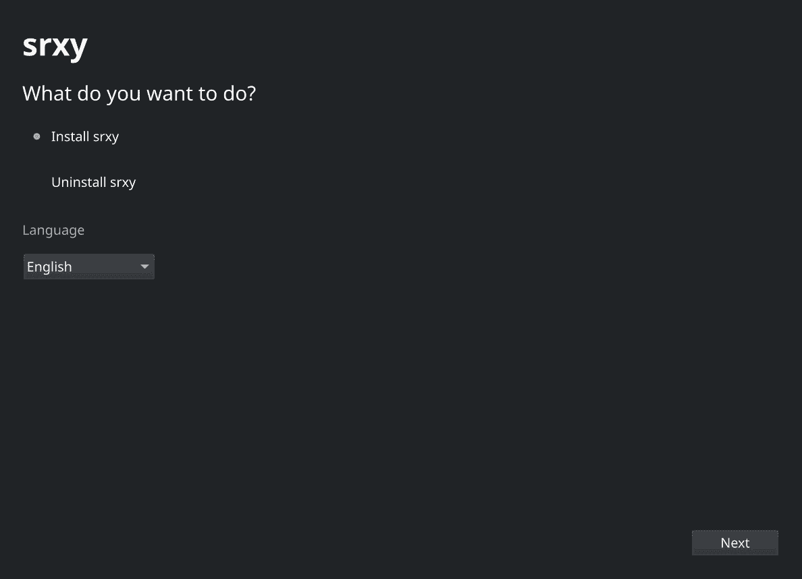
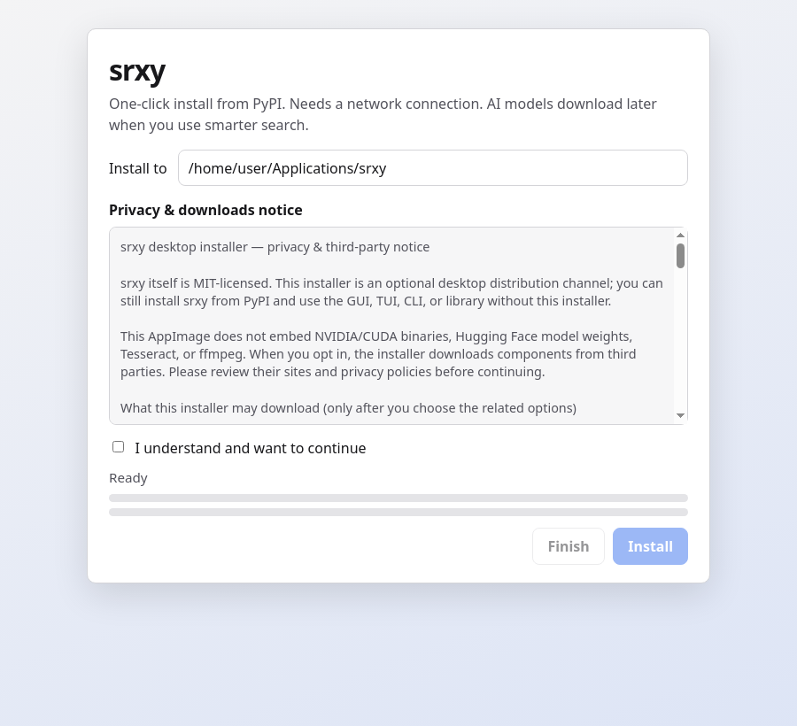
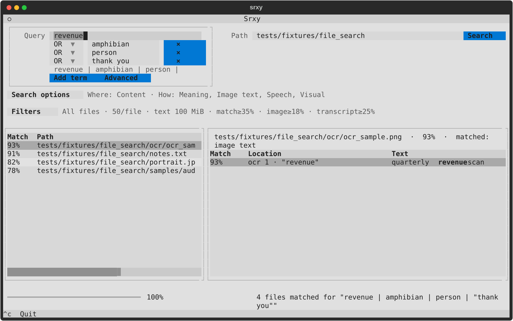

# Srxy

[](https://github.com/illescasDaniel/srxy/actions/workflows/ci.yml)
[](https://pypi.org/project/srxy/)
[](https://pypi.org/project/srxy/)

**Find files by what you mean — terminal or Python.**

Fuzzy, phonetic, and semantic matching across filenames, documents, photos, audio, video, and OS tags. On a desktop session, **srxy opens a GUI by default**; use `--tui` for the terminal UI or `--cli` for scripts and pipes.

## Installation

Needs **Python 3.11+**. `uv tool install 'srxy[semantic]'` recommended; `pipx install 'srxy[semantic]'` also works; `pipx install srxy` for core-only in a venv. Windows: add `[windows]` for Explorer tags. macOS: system `python3` may be too old — [Installation](docs/installation.md#macos).

**Platform setup (ffmpeg, tesseract):** [docs/installation.md](docs/installation.md). Privacy / third-party notice: [docs/privacy.md](docs/privacy.md).

## Quick start

**GUI (default on a graphical session):**

```bash
srxy                          # empty query/path
srxy "registry" ./src         # pre-filled; auto-starts
```

| macOS | Linux | Windows |
|:-----:|:-----:|:-------:|
|  |  |  |

Walkthrough: [docs/gui.md](docs/gui.md). Architecture: [docs/architecture.md](docs/architecture.md).

**Desktop installers (Linux, macOS, Windows):**

Grab the latest installers from [GitHub Releases](https://github.com/illescasDaniel/srxy/releases/latest) — AppImages, DMGs, and the Windows `.exe` are all there. You can also [buy the installers](https://www.daniel-ir.eu/shop/p/srxy) from the official site (includes a **signed** macOS build). Details: [docs/installers.md](docs/installers.md).





**TUI:**

```bash
srxy --tui
srxy --tui "registry" ./src
srxy --tui "transform" ./docs --ocr
```



Live scan progress, sortable results, preview pane, option chips, clipboard copy. Full walkthrough: [docs/tui.md](docs/tui.md).

**Plain CLI:**

```bash
srxy "registry" ./src --cli
srxy "revenue" ./docs --json
srxy "dog at the beach" ~/Pictures --semantic-image --content-only
srxy "revenue" ./docs --semantic-all --content-only
```

Boolean queries (`|`, `&`), scope flags, format table: [docs/cli.md](docs/cli.md).

**Python:**

```python
from pathlib import Path
from srxy import magic_file_search, magic_search

magic_file_search(Path("./src"), "registry", threshold=0.3)
magic_search([{"name": "salad"}], "salat", fields=["name"])
```

API reference: [docs/python-api.md](docs/python-api.md) · [docs/api-reference.md](docs/api-reference.md).

## Documentation

| Guide | Contents |
|-------|----------|
| [Installation](docs/installation.md) | uv tool / pipx, macOS/Linux/Windows, ffmpeg, tesseract |
| [Desktop installers](docs/installers.md) | Linux / macOS / Windows installers (free Releases + shop) |
| [TUI](docs/tui.md) | Layout, keybindings, clipboard, release checklist |
| [CLI reference](docs/cli.md) | Flags, formats, boolean queries, exit codes |
| [Power-ups](docs/power-ups.md) | OCR, semantic, CLIP, transcription, models |
| [Python API](docs/python-api.md) | `magic_file_search`, `search`, `Q`, match types |
| [API reference](docs/api-reference.md) | Generated signatures from `srxy.__all__` |
| [Development](docs/development.md) | Quality gate, `--full`, fixtures, pytest |

## Development

Requires [uv](https://docs.astral.sh/uv/).

```bash
uv sync --extra semantic
uv run task checks-fix
uv run task checks              # day-to-day (auto-scope)
uv run task checks-gui          # core+gui when working on the GUI
uv run task checks-full         # before release
uv run task checks-full-cpu     # + forced-CPU transcribe matrix
```

CI runs `core+gui+tui` buckets (no heavy/real-model suite). Details: [docs/development.md](docs/development.md).

Agent memory bank (per-branch project state): [memory/README.md](memory/README.md).

Try fixtures: `srxy "axolotl" ./tests/fixtures/file_search`

## License

MIT — see [LICENSE](LICENSE).
