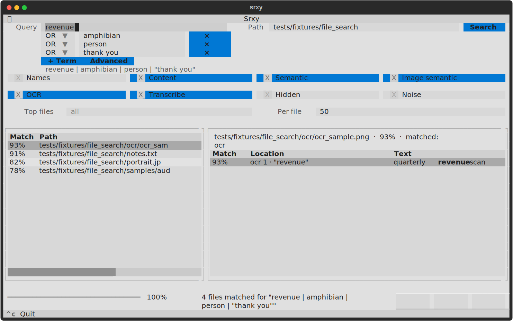

# Interactive TUI

On an interactive terminal (no `--json`, `--format flat`, or `-o`), srxy opens a **Textual** full-screen TUI by default.



The screenshot above uses this compound OR query against the repo fixtures — one branch per power-up:

```bash
srxy "revenue|amphibian|person|thank you" ./tests/fixtures/file_search --semantic-all --content-only
```

Plain CLI (same flags, no TUI): add `--no-tui`.

| OR term | Typical match | Source |
|---------|---------------|--------|
| `revenue` | `ocr/ocr_sample.png` | OCR |
| `amphibian` | `notes.txt` | content / semantic |
| `person` | `portrait.jpg` | image semantic |
| `thank you` | `samples/audio/speech_sample.mp3` | transcript |

First run with `--semantic-all` downloads models; OCR and transcribe need **tesseract** and **ffmpeg** on `PATH`. The transcript branch expects an `.mp3` under `samples/audio/` (see `tests/fixtures/README.md`).

Regenerate the screenshot: `./scripts/docs/export_tui_screenshot.sh`

## Layout

| Area | What it shows |
|------|----------------|
| **Query / Path** | Search string and root directory; **Search** runs the scan |
| **Search modes** | Dialog for what to match: names, content, semantic, OCR, archives, … |
| **Filters** | Dialog for top files, per-file match cap, and size limits (MiB) |
| **Results** | Sortable table: match %, path, sources (`name`, `content`, `ocr`, `transcript`, `tag`, …) |
| **Preview** | Selected file path, score, sources, hit table (location + **bold** query highlights) |
| **Status** | Progress, match count, copy buttons (**Path**, **Match**, **All**) |

Heavy modes run in a background worker so the UI stays responsive.

## Workflow

1. Enter query and path (or launch with args pre-filled).
2. Toggle options/filters; **Search**, **Enter**, or **Ctrl+S**.
3. **j** / **k** (or arrows) through results — preview updates.
4. **o** opens the selected file in the OS default app.

Changing query, path, options, or filters after a search marks **Search** **orange** (stale results).

## Query builder

The query area has two modes:

| Mode | Use for |
|------|---------|
| **Builder** (default) | Simple linear queries — one term per row, **AND** / **OR** between rows |
| **Advanced** | Grouped boolean syntax — `|`, `&`, and parentheses (same rules as the [CLI](cli.md#boolean-queries)) |

Click **Advanced** to edit the raw query string; click **Builder** to return to term rows. The muted preview line below shows the formatted query (or a parse error in Advanced mode).

**Builder** rows combine left-to-right: `foo` OR `bar` AND `baz` becomes `(foo | bar) & baz`. For `(foo | bar) & baz` vs `foo | (bar & baz)`, use **Advanced** or launch with a grouped CLI query:

```bash
srxy "(revenue|amphibian) & person" ./tests/fixtures/file_search
```

## Clipboard

| Key | Button | Copies |
|-----|--------|--------|
| `y` | **Path** | Absolute path of selected result |
| `m` | **Match** | Focused preview row |
| `M` | **All** | Every preview row for the file |

Uses OSC 52; most modern terminals support it.

## Keybindings

| Keys | Action |
|------|--------|
| `Enter`, `Ctrl+S` | Run search |
| `/` | Focus query |
| `j` / `k` | Move selection |
| `o` | Open file |
| `y`, `m`, `M` | Copy path / match / all |
| `?` | Help |
| `q`, `Ctrl+C` | Quit |

## When the TUI is skipped

Plain CLI when: **`--no-tui`**, **`--json`**, **`--format flat`**, **`-o`**, stdout is **not a TTY**, **stderr is not a TTY**, or **`CI=true`** (and other truthy values such as `1`, `yes`, `on`).

## Manual release checklist

Automated coverage: `pytest tests/tui/`. On a **real TTY** before release:

| Check | Verify |
|-------|--------|
| Scope toggles | Content off, Names on — results respect scope |
| OCR | Enable OCR on photos/PDFs — UI stays responsive |
| Transcribe | Enable on audio/video — UI stays responsive |
| Clipboard | `y` / `m` / `M` copy (OSC 52) |
| Open file | `o` opens in default app |
| Resize | Layout stays usable |
| Missing tesseract | Preflight shows clear error |

```bash
srxy ./tests/fixtures/file_search
srxy "axolotl" ./tests/fixtures/file_search
```
